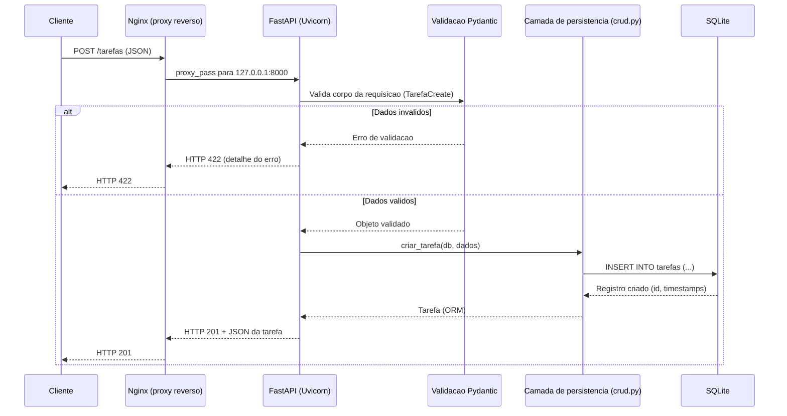

# Diagrama 2 — Fluxo de uma Requisicao HTTP

```mermaid
sequenceDiagram
    participant C as Cliente
    participant N as Nginx (proxy reverso)
    participant F as FastAPI (Uvicorn)
    participant P as Validacao Pydantic
    participant D as Camada de persistencia (crud.py)
    participant S as SQLite

    C->>N: POST /tarefas (JSON)
    N->>F: proxy_pass para 127.0.0.1:8000
    F->>P: Valida corpo da requisicao (TarefaCreate)
    alt Dados invalidos
        P-->>F: Erro de validacao
        F-->>N: HTTP 422 (detalhe do erro)
        N-->>C: HTTP 422
    else Dados validos
        P-->>F: Objeto validado
        F->>D: criar_tarefa(db, dados)
        D->>S: INSERT INTO tarefas (...)
        S-->>D: Registro criado (id, timestamps)
        D-->>F: Tarefa (ORM)
        F-->>N: HTTP 201 + JSON da tarefa
        N-->>C: HTTP 201
    end
```
