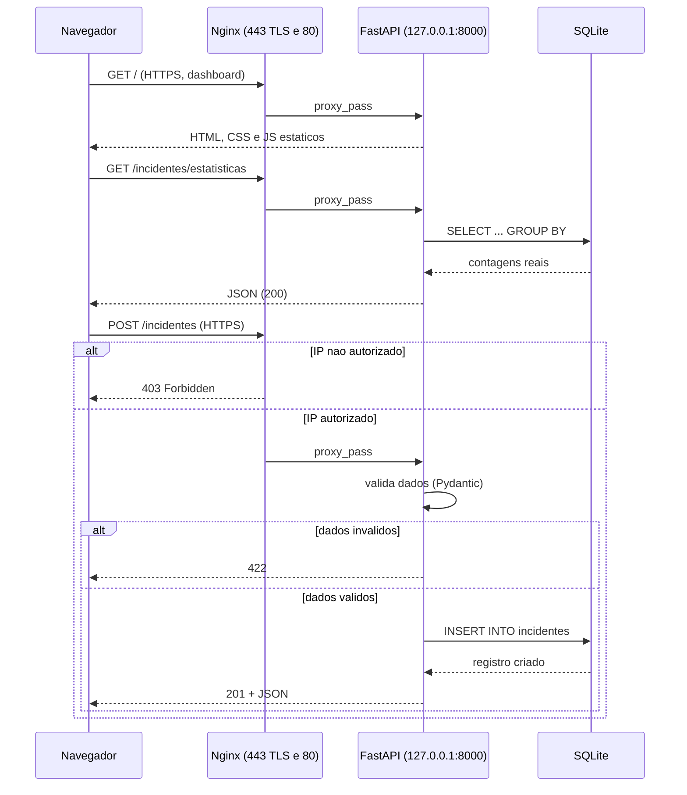

# Diagrama 2 — Fluxo HTTP: navegador, Nginx, FastAPI e SQLite

```mermaid
sequenceDiagram
    participant N as Navegador
    participant X as Nginx (443 TLS e 80)
    participant F as FastAPI (127.0.0.1:8000)
    participant S as SQLite

    N->>X: GET / (HTTPS, dashboard)
    X->>F: proxy_pass
    F-->>N: HTML, CSS e JS estaticos
    N->>X: GET /incidentes/estatisticas
    X->>F: proxy_pass
    F->>S: SELECT ... GROUP BY
    S-->>F: contagens reais
    F-->>N: JSON (200)

    N->>X: POST /incidentes (HTTPS)
    alt IP nao autorizado
        X-->>N: 403 Forbidden
    else IP autorizado
        X->>F: proxy_pass
        F->>F: valida dados (Pydantic)
        alt dados invalidos
            F-->>N: 422
        else dados validos
            F->>S: INSERT INTO incidentes
            S-->>F: registro criado
            F-->>N: 201 + JSON
        end
    end
```
