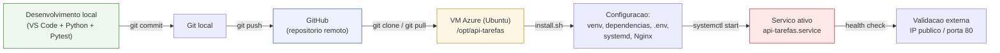

# Diagrama 4 — Processo de Deploy

```mermaid
flowchart LR
    A["Desenvolvimento local\n(VS Code + Python + Pytest)"] -->|git commit| B["Git local"]
    B -->|git push| C["GitHub\n(repositorio remoto)"]
    C -->|git clone / git pull| D["VM Azure (Ubuntu)\n/opt/api-tarefas"]
    D -->|install.sh| E["Configuracao:\nvenv, dependencias, .env,\nsystemd, Nginx"]
    E -->|systemctl start| F["Servico ativo\napi-tarefas.service"]
    F -->|health check| G["Validacao externa\nIP publico / porta 80"]

    style A fill:#eef7ee,stroke:#2e7d32
    style C fill:#eef2ff,stroke:#3949ab
    style D fill:#fff7e6,stroke:#cc8400
    style F fill:#ffe8e8,stroke:#c62828
```

**Atualizacoes futuras** usam `deploy/deploy.sh`, que executa backup do
banco, `git pull`, atualizacao de dependencias e reinicio do servico.
