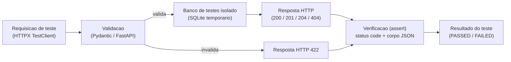

# Diagrama 5 — Processo de Testes

```mermaid
flowchart LR
    R["Requisicao de teste\n(HTTPX TestClient)"] --> V["Validacao\n(Pydantic / FastAPI)"]
    V -->|invalida| E1["Resposta HTTP 422"]
    V -->|valida| B["Banco de testes isolado\n(SQLite temporario)"]
    B --> RESP["Resposta HTTP\n(200 / 201 / 204 / 404)"]
    RESP --> VER["Verificacao (assert)\nstatus code + corpo JSON"]
    E1 --> VER
    VER --> RES["Resultado do teste\n(PASSED / FAILED)"]
```

A suite real (`tests/test_api.py`, 19 testes) foi executada com
`pytest`, com resultado **19 passed** registrado no Capitulo 9 do
relatorio tecnico.
